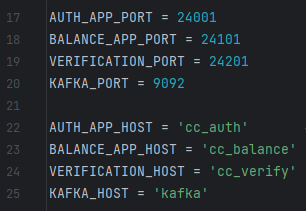

# Вклад в проект "Shift Rest"

## Введение

Этот файл предназначен для разработчиков, которые хотят внести свой вклад в проект. Здесь вы найдете информацию о том, как настроить проект для разработки, структуру проекта, а также рекомендации и требования по стилю кода.

## Сетап для разработки

1. Клонируйте репозиторий:
```
git clone [ссылка на ВАШ форк этого репозитория]
```

2. Перейдите в директорию проекта:
```
cd credit_card
```

3. Установите все зависимости с помощью [Poetry](https://python-poetry.org/):
```
poetry install
```

4. Активация виртуального окружение для запуска приложения или flake8, mypy и pytest:
```
poetry shell
```

5. Запуск приложения:

`docker compose up -d`


Запуск без докера(not recommended):

```
python main_auth.py - для сервиса авторизации на 24001 (C HTTPS)
python main_balance.py - для сервиса баланса на 24101
python main_verify.py - для сервиса верификации на 24201
```

Для работы с сервисом без докера необходимо настроить пути между сервисами в файле [config.py](config%2Fconfig.py)



Для работы с БД используется SQLAlchemy ORM.

Запуск для проверки работоспособности:
1) Поднять контейнеры:
```shell
docker compose up -d
```
2) Миграции можно запустить из папки с проектом, предварительно раскомментировав строку 12 в [env.py](alembic%2Fenv.py):
    ```shell
    poetry run alembic upgrade head
    ```

    или из контейнера cc_auth(После того как он запустится. Проверьте как назван ваш контейнер):
    ```shell
   docker exec -it credit_card-cc_auth alembic upgrade head
    ```

## Структура проекта

Проект разделен на три микросервиса: авторизация (`credit_card_auth`),
баланс и транзакционные операции (`credit_card_balance`),
верификация (`credit_card_verify`).

Единый для всех сервисов конфигурационный файл:
- `config/`[config.py](config%2Fconfig.py) : Файл с константами для приложения.
  - AUTH_APP_PORT : Сервис авторизации. Порт, на котором будет запущено приложение.
  - AUTH_APP_HOST : Сервис авторизации. Хост приложения.
  - BALANCE_APP_PORT : Сервис Баланса. Порт, на котором будет запущено приложение.
  - BALANCE_APP_HOST : Сервис Баланса. Хост приложения.
  - VERIFICATION_PORT : Сервис Верификации. Порт, на котором будет запущено приложение.
  - VERIFICATION_HOST : Сервис Верификации. Хост приложения.
  - KAFKA_HOST : Хост Kafka.
  - PRE_INSTALLED_CARD_NUMBER : Номер карты, который будет добавлен при первоначальной инициализации приложения для тестирования.
  - PRE_INSTALLED_CARD_DATA: Данные карты^
  - TEST_USER_LOGIN: Логин предустановленного пользователя.
  - TEST_USER_PASSWORD: Пароль предустановленного пользователя.

### Микросервис: credit_card_auth

- [main_auth.py](main_auth.py) : Основной файл приложения.

- `src` : Исходный код проекта.
  - [database](src%2Fdatabase) : Файлы для работы с базой данных.
  - [repositories](credit_card_auth%2Fsrc%2Frepositories) : Файлы с репозиториями для работы с базой данных.
  - [routers](credit_card_auth%2Fsrc%2Frouters) : Файлы с описанием эндпоинтов.
  - [schemas](credit_card_auth%2Fsrc%2Fschemas) : Схемы данных.
  - [services](credit_card_auth%2Fsrc%2Fservices) : Файлы с сервисами для работы с приложением.

- `tests`: Тесты сервиса.
  - `unit`: Юнит тесты разбиты по файлам в соответствии со структурой проекта.
  - `integration`: Сценарий интеграционных тестов из задания в одном файле + тесты API.

  #### БД:
  Для данного сервиса нужна всего одна таблица c пользователями веб портала auth.

  

  Модель описана в файле [base.py](credit_card_auth%2Fsrc%2Fdatabase%2Fbase.py)


### Микросервис: credit_card_balance
- [main_balance.py](main_balance.py) : Основной файл приложения.

- `src` : Исходный код проекта.
  - [database](src%2Fdatabase) : Файлы для работы с базой данных и модели.
  - [repositories](credit_card_balance%2Fsrc%2Frepositories) : Файлы с репозиториями для работы с базой данных.
  - [routers](credit_card_balance%2Fsrc%2Frouters) : Файлы с описанием эндпоинтов.
  - [schemas](credit_card_balance%2Fsrc%2Fschemas) : Схемы данных.
  - [services](credit_card_balance%2Fsrc%2Fservices) : Файлы с сервисами для работы с приложением.

  - `tests`: Тесты сервиса.
    - `unit`: Юнит тесты разбиты по файлам в соответствии со структурой проекта.
    - `integration`: Сценарий интеграционных тестов из задания в одном файле + тесты API.

    #### БД:
    Таблицы для хранения логов(Balance и Common) и карточек.

    

    Модель описана в файле [base.py](credit_card_balance%2Fsrc%2Fdatabase%2Fbase.py)


### Микросервис: credit_card_verify
- [main_verify.py](main_verify.py) : Основной файл приложения.

- `src` : Исходный код проекта.
  - [routers](credit_card_verify%2Fsrc%2Frouters) : Файлы с описанием эндпоинтов.
  - [schemas](credit_card_verify%2Fsrc%2Fschemas) : Схемы данных.
  - [services](credit_card_verify%2Fsrc%2Fservices) : Файлы с сервисами для работы с приложением.

- `tests`: Тесты сервиса.
  - `integration`: Сценарий интеграционных тестов из задания в одном файле + тесты API.

### Общие файлы
- [alembic](alembic) : Скрипты для миграции.
- [CHANGELOG.md](CHANGELOG.md) : История изменений проекта.
- `CONTRIBUTING.md` : Рекомендации для контрибьюторов (вы сейчас читаете его).
- [README.md](README.md) : Описание проекта.

## Процесс внесения изменений

1. Создайте форк проекта на GitLab.
2. Клонируйте ваш форк на свой локальный компьютер.
3. Создайте новую ветку для ваших изменений.
4. Внесите необходимые изменения и убедитесь, что все тесты проходят.
5. Отправьте ваши изменения на проверку в виде pull/merge request в основной репозиторий.

## Кодовые стандарты и соглашения

Мы следуем стандартам кодирования, предложенным `wemake-python-styleguide`, а также проверяем типы с помощью `mypy`. Убедитесь, что ваш код соответствует этим требованиям перед отправкой на ревью.

## Процесс ревью

Все изменения в проекте проходят процесс проверки другими разработчиками. Ваш код будет проверен на соответствие стандартам качества и функциональности.

## Полезные ссылки

- [wemake-python-styleguide](https://github.com/wemake-services/wemake-python-styleguide)
- [mypy](http://mypy-lang.org/)
