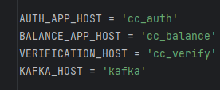
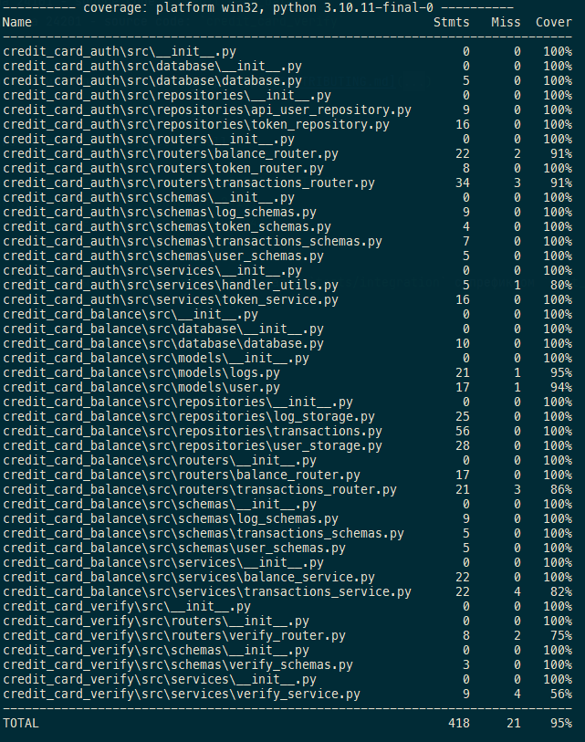

## Week7. SHIFT-691. Задание 2. Внедрить Postgres в сервисах.

Для работы с БД используется SQLAlchemy ORM.

Запуск для проверки работоспособности:
1) Поднять контейнеры:
```shell
docker compose up -d
```
2) Миграции можно запустить из папки с проектом, предварительно раскомментировав строку 12 в [env.py](alembic%2Fenv.py):
    ```shell
    poetry run alembic upgrade head
    ```

    или из контейнера cc_auth(После того как он запустится. Проверьте как назван ваш контейнер):
    ```shell
   docker exec -it credit_card-cc_auth alembic upgrade head
    ```

## Week7. SHIFT-690. Задание 1. Реляционное представление доменной модели

Допущения:
- Информация об изображениях не должна храниться в БД. сервис верификации не имеет доступа к бд и путь к к изображению передается через кафка.
- Логи должны быть сохранены, поэтому для упрощения жизни логов использую одну таблицу для всех карточек. Как активных, так и заблокированных.
- Управление временным штампом логов отдано БД. Single source of truth, так сказать.

В папку [db](db) добавлены файлы с описанием схемы БД, скриптами для её создания и CRUD операциями.


Схемы для https://dbdiagram.io/d описаны в файлах:

[additional_task_schemas](db%2Fadditional_task%2Fadditional_task_schemas) - дополнительная задача.

[db_schemas](db%2Fauth%2Fdb_schemas) - веб-сервис авторизации.

[db_schemas](db%2Fbalance%2Fdb_schemas) - сервис баланса.

[additional_task](db%2Fadditional_task) - Дополнительное задание на проектирование БД


[auth](db%2Fauth) - Таблица пользователей для веб-сервиса авторизации.


[balance](db%2Fbalance) - Таблицы для работы с операциями по карте.


Ради уменьшения размера репо убрал файл с весами и закомментил строку в [Dockerfile-verify](docker%2FDockerfile-verify).
Теперь после запуска сервиса при первом запросе он скачает веса модели, что займет определенное время(600мб как-никак).
Либо можно докинуть файл. Он есть в ветке week6_shift_620.(тогда строку стоит раскомментить).

## Week6. SHIFT-620. Dockerfile для своего проекта.
Созданы Dockerfile для каждого сервиса.

[Dockerfile-kafka](docker%2FDockerfile-kafka) - для запуска кафки в контейнере. На основе bitnami/kafka:latest.

[Dockerfile-auth](docker%2FDockerfile-auth) - для запуска сервиса авторизации в контейнере.

[Dockerfile-balance](docker%2FDockerfile-balance) - для запуска сервиса баланса в контейнере.

[Dockerfile-verify](docker%2FDockerfile-verify) - для запуска сервиса верификации в контейнере.

На текущий момент все сервисы запускаются в одном контейнере поэтому в конфиге хосты указаны именами сервисов из docker-compose.



Предустановленные пользователи и карточки в конфиге [config.py](config%2Fconfig.py)


Данные предустановленного пользователя:
```
логин: test_user
пароль: test_password
```

### Сборка образов и запуск контейнеров:
Сети:

    cc_main_net: Основная сеть для всех сервисов.

Сервисы:

    cc_zookeeper:
        Использует образ bitnami/zookeeper:latest.
        Всегда перезапускается при остановке.
        Подключен к сети cc_main_net.

    cc_kafka:
        Строится на основе Dockerfile-kafka.
        Зависит от zookeeper.
        Имеет проверку здоровья через healthcheck-kafka.sh.
        Подключен к сети cc_main_net.

    cc_auth:
        Сервис аутентификации.
        Строится на основе Dockerfile-auth.
        Зависит от kafka (ожидает, пока Kafka будет здоров).
        Проброс порта 24001 на хостовую машину.
        Использует том photo_storage.
        Подключен к сети cc_main_net.

    cc_balance:
        Сервис баланса.
        Строится на основе Dockerfile-balance.
        Зависит от kafka.
        Подключен к сетям cc_main_net и cc_balance_net(В дальнейшем будем использовать её для связи с БД).

    cc_verify:
        Сервис верификации.
        Строится на основе Dockerfile-verify.
        Зависит от kafka.
        Использует том photo_storage.
        Подключен к сети cc_main_net.

Тома:

    photo_storage: Используется для хранения фотографий. Используется сервисами cc_auth и cc_verify.

Запуск всех сервисов по команде `docker-compose up` или `docker compose -f .\docker-compose.yaml up`.
Также можно использовать флаг `-d` для 'тихого' запуска сервисов.

При возникновении ошибок необходимо перезапустить сервис вручную.
После перезапуска сервиса кафка необходимо перезапустить сервисы cc_*.

На всякий случай добавлю алгоритм для поднятия всего без docker-compose:

```
docker network create cc_main_net
docker volume create photo_storage

docker run -d --name cc_zookeeper --network cc_main_net -e ALLOW_ANONYMOUS_LOGIN=yes bitnami/zookeeper:latest

docker build -t custom-kafka:latest -f docker/Dockerfile-kafka .

docker run -d --name cc_kafka --network cc_main_net --link cc_zookeeper -e ALLOW_PLAINTEXT_LISTENER=yes -e KAFKA_CFG_ZOOKEEPER_CONNECT=cc_zookeeper:2181 -e KAFKA_CFG_ADVERTISED_LISTENERS=PLAINTEXT://cc_kafka:9092 custom-kafka:latest

docker build -t cc_auth:latest -f docker/Dockerfile-auth .

docker run -d --name cc_auth --network cc_main_net --link cc_kafka -p 24001:24001 -v photo_storage:/app/photo_storage/ cc_auth:latest

docker build -t cc_balance:latest -f docker/Dockerfile-balance .

docker run -d --name cc_balance --network cc_main_net --link cc_kafka cc_balance:latest

docker build -t cc_verify:latest -f docker/Dockerfile-verify .

docker run -d --name cc_verify --network cc_main_net --link cc_kafka -v photo_storage:/app/photo_storage cc_verify:latest
```

## Week5. SHIFT-560. Добавить сервис верификации пользователя с deepface.
Добавлена работа с локальной кафкой.

Между запуском zookeper и kafka(независимо от способа запуска, в контейнере или локально) нужно выдержать паузу. если kafka завершается повторить команду запуска до получения результата.

Только после этого следует запускать сервисы проекта.

Если сервис верификации не возвращает ответы ругаясь на tensorflow и иже с ними его следует перезапустить.

Все это будет автоматизировано в следующих версиях при работе с контейнерами.

### Установка кафка без докера:
```
Скачать архив кафки:
curl -O https://dlcdn.apache.org/kafka/3.5.0/kafka_2.13-3.5.0.tgz

Разархивировать в папку с проектом:
tar -xzf kafka_2.13-3.5.0.tgz

В файле server.properties указать порт для листнера кафки - listeners=PLAINTEXT://:24301
sed -i 's/#listeners=PLAINTEXT:\/\/:9092/listeners=PLAINTEXT:\/\/:24301/' kafka_2.13-3.5.0/config/server.properties

Установка джавы:
sudo apt update
sudo apt install openjdk-11-jdk

Запуск зоокипера:
kafka_2.13-3.5.0/bin/zookeeper-server-start.sh kafka_2.13-3.5.0/config/zookeeper.properties

Запуск брокера кафки:
kafka_2.13-3.5.0/bin/kafka-server-start.sh kafka_2.13-3.5.0/config/server.properties

Создание топиков:
kafka_2.13-3.5.0/bin/kafka-topics.sh --create --topic gran_verify --bootstrap-server localhost:24301 --partitions 1 --replication-factor 1
kafka_2.13-3.5.0/bin/kafka-topics.sh --create --topic gran_verify_response --bootstrap-server localhost:24301 --partitions 1 --replication-factor 1
```

### Установка и запуск Kafka в докере:
```
Грузим образ(если нет) и запускаем контейнер с зоокипером

docker run -d --name zookeeper -e ALLOW_ANONYMOUS_LOGIN=yes bitnami/zookeeper:latest

Теперь кафку

docker run -d --name kafka -e ALLOW_PLAINTEXT_LISTENER=yes -e KAFKA_CFG_ZOOKEEPER_CONNECT=zookeeper:2181 -e KAFKA_ADVERTISED_LISTENERS=PLAINTEXT://host.docker.internal:24301 -p 24301:9092 --link zookeeper:zookeeper bitnami/kafka:latest

Создаем топики

docker exec -it kafka /opt/bitnami/kafka/bin/kafka-topics.sh --create --topic gran_verify --bootstrap-server host.docker.internal:24301 --partitions 1 --replication-factor 1
docker exec -it kafka /opt/bitnami/kafka/bin/kafka-topics.sh --create --topic gran_verify_response --bootstrap-server host.docker.internal:24301 --partitions 1 --replication-factor 1
```
Обновлены тесты.



## Week5. SHIFT-559. Сервис авторизации и проксирования запросов
Сервис разбит на три микросервиса:
- Сервис авторизации на 24001 (C HTTPS) - source code: `credit_card_auth`
- Сервис баланса на 24101 - source code: `credit_card_balance`
- Сервис верификации на 24201 - source code: `credit_card_verify`

Документация к сервисам находится в папке `docs` в формате `service_name.yaml` и в папках с сервисами в формате JSON.
Скрипт генерации апи - [get_api.py](get_api.py)

Порядок запуска приложения и полное описание структуры [CONTRIBUTING.md](CONTRIBUTING.md)


Запуск приложения из оболочки poetry(poetry shell):
```
python main_auth.py - для сервиса авторизации на 24001 (C HTTPS)
python main_balance.py - для сервиса баланса на 24101
python main_verify.py - для сервиса верификации на 24201
```

Весь код покрыт тестами. Тесты эндпоинтов находятся в папке `tests/integration` с префиксом `test_api_`.


## Credit card api.


---
# Оглавление
1. TBU

## Описание файлов проекта и инструкция по запуску сервиса:

[CONTRIBUTING.md](CONTRIBUTING.md)

## Проверка работоспособности сервиса

Откройте веб-браузер и перейдите по адресу `http://localhost:8000`. Вы должны увидеть ответ от вашего приложения.
Данные предустановленного пользователя:
```
логин: test_user
пароль: test_password
```

## Просмотр автоматически сгенерированной документации FastAPI

FastAPI автоматически генерирует документацию для вашего API. Чтобы просмотреть её, перейдите по адресу `http://localhost:8000/docs` в вашем браузере.

# Описание API

## Эндпоинты

### `POST /token`

Этот эндпоинт предназначен для получения токена доступа. В теле запроса необходимо передать следующие параметры:

- `username`: Имя пользователя.
- `password`: Пароль пользователя.

При успешном выполнении запроса сервер вернёт объект с токеном доступа.
