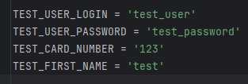

## Week5. SHIFT-560. Добавить сервис верификации пользователя с deepface.
Добавлена работа с локальной кафкой.
Предустановленные пользователи и карточки в конфиге [config.py](config%2Fconfig.py)



### Установка кафка без докера:
```
Скачать архив кафки:
curl -O https://dlcdn.apache.org/kafka/3.5.0/kafka_2.13-3.5.0.tgz

Разархивировать в папку с проектом:
tar -xzf kafka_2.13-3.5.0.tgz

В файле server.properties указать порт для листнера кафки - listeners=PLAINTEXT://:24301
sed -i 's/#listeners=PLAINTEXT:\/\/:9092/listeners=PLAINTEXT:\/\/:24301/' kafka_2.13-3.5.0/config/server.properties

Установка джавы:
sudo apt update
sudo apt install openjdk-11-jdk

Запуск зоокипера:
kafka_2.13-3.5.0/bin/zookeeper-server-start.sh kafka_2.13-3.5.0/config/zookeeper.properties

Запуск брокера кафки:
kafka_2.13-3.5.0/bin/kafka-server-start.sh kafka_2.13-3.5.0/config/server.properties

Создание топиков:
kafka_2.13-3.5.0/bin/kafka-topics.sh --create --topic gran_verify --bootstrap-server localhost:24301 --partitions 1 --replication-factor 1
kafka_2.13-3.5.0/bin/kafka-topics.sh --create --topic gran_verify_response --bootstrap-server localhost:24301 --partitions 1 --replication-factor 1
```

### Установка и запуск Kafka в докере:
```
Грузим образ(если нет) и запускаем контейнер с зоокипером

docker run -d --name zookeeper -e ALLOW_ANONYMOUS_LOGIN=yes bitnami/zookeeper:latest

Теперь кафку

docker run -d --name kafka -e ALLOW_PLAINTEXT_LISTENER=yes -e KAFKA_CFG_ZOOKEEPER_CONNECT=zookeeper:2181 -e KAFKA_ADVERTISED_LISTENERS=PLAINTEXT://host.docker.internal:24301 -p 24301:9092 --link zookeeper:zookeeper bitnami/kafka:latest

Создаем топики

docker exec -it kafka /opt/bitnami/kafka/bin/kafka-topics.sh --create --topic gran_verify --bootstrap-server host.docker.internal:24301 --partitions 1 --replication-factor 1
docker exec -it kafka /opt/bitnami/kafka/bin/kafka-topics.sh --create --topic gran_verify_response --bootstrap-server host.docker.internal:24301 --partitions 1 --replication-factor 1
```


## Week5. SHIFT-559. Сервис авторизации и проксирования запросов
Сервис разбит на три микросервиса:
- Сервис авторизации на 24001 (C HTTPS) - source code: `credit_card_auth`
- Сервис баланса на 24101 - source code: `credit_card_balance`
- Сервис верификации на 24201 - source code: `credit_card_verify`

Документация к сервисам находится в папке `docs` в формате `service_name.yaml` и в папках с сервисами в формате JSON.

Порядок запуска приложения и полное описание структуры [CONTRIBUTING.md](CONTRIBUTING.md)


Запуск приложения из оболочки poetry(poetry shell):
```
python main_auth.py - для сервиса авторизации на 24001 (C HTTPS)
python main_balance.py - для сервиса баланса на 24101
python main_verify.py - для сервиса верификации на 24201
```

Весь код покрыт тестами. Тесты эндпоинтов находятся в папке `tests/integration` с префиксом `test_api_`.


## Credit card api.


---
# Оглавление
1. TBU

## Описание файлов проекта и инструкция по запуску сервиса:

[CONTRIBUTING.md](CONTRIBUTING.md)

## Проверка работоспособности сервиса

Откройте веб-браузер и перейдите по адресу `http://localhost:8000`. Вы должны увидеть ответ от вашего приложения.
Данные предустановленного пользователя:
```
логин: test_user
пароль: test_password
```

## Просмотр автоматически сгенерированной документации FastAPI

FastAPI автоматически генерирует документацию для вашего API. Чтобы просмотреть её, перейдите по адресу `http://localhost:8000/docs` в вашем браузере.

# Описание API

## Эндпоинты

### `POST /token`

Этот эндпоинт предназначен для получения токена доступа. В теле запроса необходимо передать следующие параметры:

- `username`: Имя пользователя.
- `password`: Пароль пользователя.

При успешном выполнении запроса сервер вернёт объект с токеном доступа.
